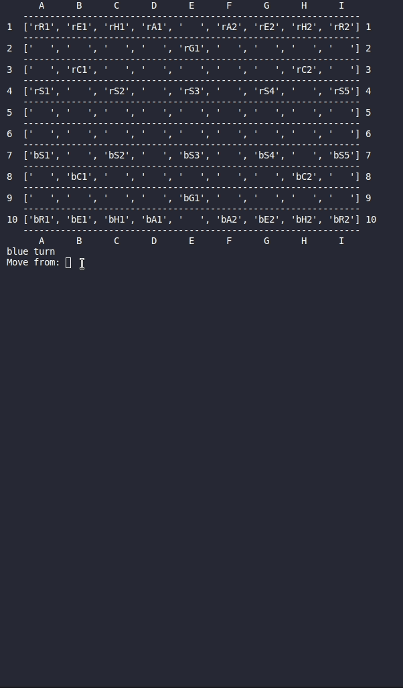
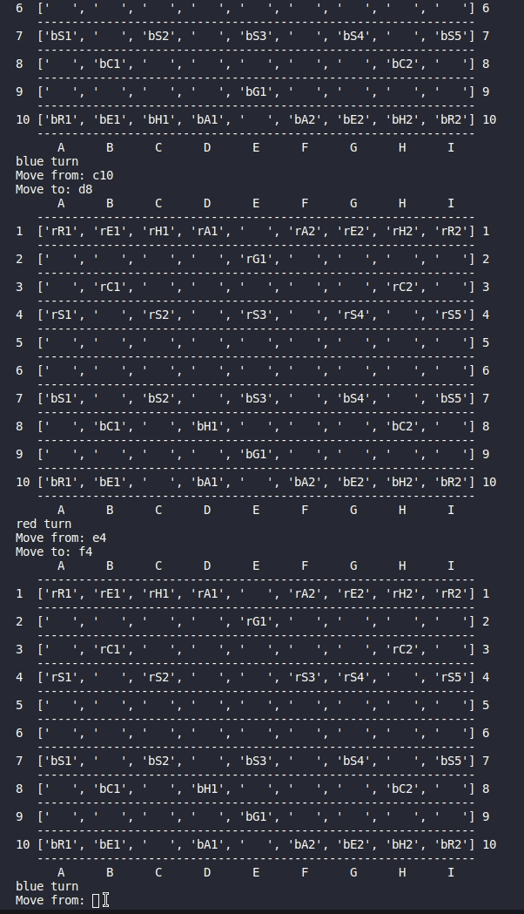
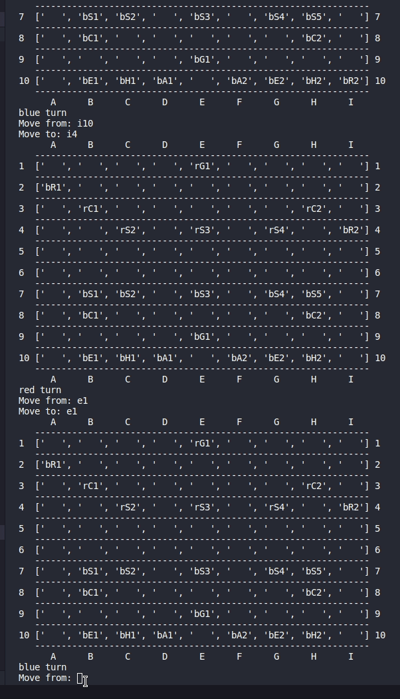

# Janggi
A command line implementation of the abstract board game [Janggi (Korean Chess)](https://en.wikipedia.org/wiki/Janggi). 

## Technologies
- Python 3.8

## Approach
My approach to building this game was to use object oriented programming (OOP). I built a board class to represent the board and specific spaces on the board. The board class also kept track of whether a space was occupied, and by what piece. For the pieces, I implemented a MasterPiece class that individual pieces inherit from which held several of the basic piece data members, such as the type, color, valid moves, and location. Individual piece classes contained methods that handled the piece's movement capabilities to determine move validity. The Game class initializes the board and places pieces on the board. It keeps track of whose turn it is to move, whether a player is in check, and determines when the game has been won by checkmate. 

## How To Play
Ensure Python 3.6 or greater is installed.
'''shell
foo@bar:~$ python3 --version
'''

Clone this repository.
'''shell
foo@bar:~$ git clone https://github.com/dakotajunkman/Janggi
'''

Run main.py.
'''shell
foo@bar:~$ python3 main.py
'''

## Piece Overview
Pieces are represented on the board textually. The first letter is 'r' or 'b' for red or blue, representing the color of the piece. The second letter is the type of piece (see below). The third character is a number for pieces that have more than one instance.
- R: Chariot (similar to a chess rook)
- E: Elephant
- H: Horse
- A: Advisor (also known as guard)
- G: General (similar to chess King)
- C: Cannon
- S: Soldier (similar to chess pawn)

## Illustrations
The game utilizes algebraic notation to represent squares. Columns are letters and rows are numbers.
Players type in the square to move from to select the piece to move, then select the square to move
to in order to move the piece.   

When a player's general is threatened, an output message notifies the player that they are in check.   

When the game has been won, the game loop terminates and the player that won the game is displayed to output.   

